<div align="center">


# Hey, I'm Mayuresh Zende 👋

[](https://git.io/typing-svg)

<br/>

[](https://www.linkedin.com/in/mayuresh-zende/)
[](https://mayureshzende.netlify.app)
[](mailto:mayureshzende@gmail.com)
[](https://dev.to/mayureshzende)
[](https://leetcode.com/mayureshzende/)

<br/>


</div>

---

## 🧑‍💻 About Me

```ts
const mayuresh = {
  role:       "Full Stack Software Engineer",
  location:   "Dubai, UAE 🇦🇪",
  company:    "Emirates NBD",
  stack:      ["React", "Node.js", "TypeScript", "MongoDB", "Kafka", "AWS"],
  currently:  "Building a micro-frontend deal management platform for corporate banking",
  openTo:     "Dubai | Europe | Remote opportunities",
  funFact:    "Can't go a day without coding, reading, or lifting 🏋️",
};
```

- 🏦 **6+ years** building scalable fintech & enterprise web applications
- ⚡ Passionate about **micro-frontends**, **event-driven architecture**, and **clean code**
- 🤖 Active user of **GitHub Copilot** & **Claude AI** — AI-augmented development is my workflow
- 🌍 Experience across **UAE, India** — open to roles across **Europe & globally**
- 🧪 TDD advocate — **85–100% test coverage** is my standard, not a stretch goal

---

## 🛠️ Tech Stack

<div align="center">

<table>
  <tr>
    <td valign="top" width="50%">

**` 〈 / 〉 ` &nbsp; Languages**


---

**`⬡` &nbsp; Frontend**


---

**`⚙` &nbsp; Backend**


</td>
<td valign="top" width="50%">

**`⬡` &nbsp; Databases**


---

**`☁` &nbsp; Cloud & DevOps**


---

**`◈` &nbsp; Testing & Tools**


&nbsp;

</td>
  </tr>
</table>

<br/>

> 🤖 &nbsp;**AI-augmented workflow** &nbsp;—&nbsp; daily driver: &nbsp;`GitHub Copilot` &nbsp;+&nbsp; `Claude AI` &nbsp;+&nbsp; `Prompt Engineering`

</div>

---

## 🏆 GitHub Trophies

<div align="center">

[](https://github.com/ryo-ma/github-profile-trophy)

</div>

---

## 📊 GitHub Stats

<div align="center">

| Stats | Streak | Languages |
|:---:|:---:|:---:|
|  |  |  |

</div>

---

## 🐍 Contribution Graph

<div align="center">

<picture>
  <source media="(prefers-color-scheme: dark)" srcset="./only-svg/github-contribution-grid-snake-dark.svg" />
  <source media="(prefers-color-scheme: light)" srcset="./only-svg/github-contribution-grid-snake.svg" />
  
</picture>

</div>

---

## 📈 Activity Overview

<div align="center">

<details>
<summary>📂 &nbsp;Expand detailed metrics</summary>
<br/>

| Overview | Languages |
|:---:|:---:|
|  |  |

| LeetCode | Achievements |
|:---:|:---:|
|  |  |

</details>

</div>

---

## 💼 What I'm Working On

> **@ Emirates NBD, Dubai** — Building a mission-critical React micro-frontend deal management platform for corporate banking — complete product ownership from requirements to production. Stack: React, Node.js, TypeScript, MongoDB, Kafka, Jenkins CI/CD.

---

## 🤝 Let's Connect

<div align="center">

I'm always open to interesting projects, collaborations, or just a good tech conversation.

[](https://www.linkedin.com/in/mayuresh-zende/)
[](https://mayureshzende.netlify.app)
[](mailto:mayureshzende@gmail.com)

<br/>

---

*"First, solve the problem. Then, write the code."* — John Johnson

</div>
